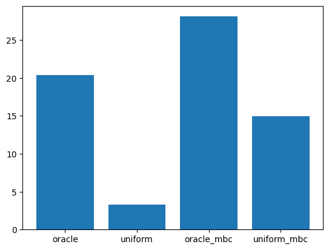
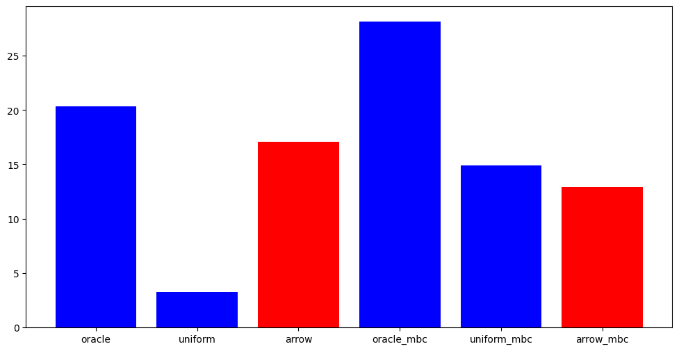
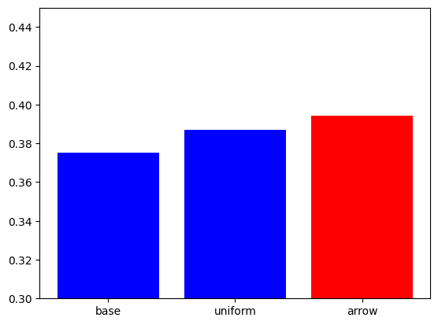

# MBC + Arrow using microsoft/MTTL

In this notebook, we will show how to use our repo (https://github.com/microsoft/mttl.git) to train experts, do MBC clustering and then apply Arrow routing algorithms to downstream tasks.

Refer to the paper https://arxiv.org/pdf/2405.11157 for more details!


```python
# let's install MTTL first, and clone it to have access to sample scripts

!pip install git+https://github.com/microsoft/mttl
!pip install triton
!pip install huggingface_hub --upgrade
!git clone https://github.com/microsoft/mttl.git
```

# Training Experts

MTTL offers some quick code to train some experts for FLAN and storing them into an "Expert Library". An expert library contains a list of experts and their parameters and that can be stored locally, on HF or on Azure.

The following code trains 8 experts on a subset of data from FLAN (with subsampled examples for each expert) and store them in a local library.

If you don't want to execute the following code, you can alternatively create the local expert library from a pretrained library we provide in `sordonia/trained_gpt125m_experts_colab` (see code below).


```python
#############################
# OPTIONAL -- DO NOT EXECUTE
#############################

%%bash

TASKS=(
    "wiqa_what_is_the_final_step_of_the_following_process"
    "sciq_Multiple_Choice"
    "adversarial_qa_droberta_answer_the_following_q"
    "duorc_SelfRC_question_answering"
    "cos_e_v1_11_description_question_option_id"
    "wiki_qa_Is_This_True_"
    "quail_description_context_question_text"
    "wiki_hop_original_explain_relation"
)

for TASK in "${TASKS[@]}"
do
  echo "Processing: $TASK"
  python mttl/projects/modular_llm/train_experts.py -c mttl/projects/modular_llm/configs/models/gptneo_125m_fast.json \
  -k finetune_task_name=$TASK \
  -k library_id=local://trained_gpt125m_experts_colab
done
```


```python
# let's load the library and see its contents
import os
from mttl.models.library.expert_library import ExpertLibrary

if not os.path.exists("trained_gpt125m_experts_colab"):
    library = ExpertLibrary.get_expert_library("hf://sordonia/trained_gpt125m_experts_colab")

    # let's create a local clone of this library! This step is not necessary if we trained experts above!
    library = library.clone("local://trained_gpt125m_experts_colab")
else:
    library = ExpertLibrary.get_expert_library("local://trained_gpt125m_experts_colab")

# Let's see which experts are in the library... :-)
for expert_name in library.keys():
    print("Expert: ", expert_name, " with config: ", library[expert_name].expert_config)
```

    /usr/local/lib/python3.10/dist-packages/huggingface_hub/utils/_auth.py:94: UserWarning: 
    The secret `HF_TOKEN` does not exist in your Colab secrets.
    To authenticate with the Hugging Face Hub, create a token in your settings tab (https://huggingface.co/settings/tokens), set it as secret in your Google Colab and restart your session.
    You will be able to reuse this secret in all of your notebooks.
    Please note that authentication is recommended but still optional to access public models or datasets.
      warnings.warn(


    duorc_SelfRC_question_answering.meta:   0%|          | 0.00/4.90k [00:00<?, ?B/s]


    (…)_qa_droberta_answer_the_following_q.meta:   0%|          | 0.00/4.90k [00:00<?, ?B/s]


    (…)l_description_context_question_text.meta:   0%|          | 0.00/4.90k [00:00<?, ?B/s]


    (…)1_11_description_question_option_id.meta:   0%|          | 0.00/4.90k [00:00<?, ?B/s]


    sciq_Multiple_Choice.meta:   0%|          | 0.00/4.90k [00:00<?, ?B/s]


    wiki_hop_original_explain_relation.meta:   0%|          | 0.00/4.90k [00:00<?, ?B/s]


    (…)final_step_of_the_following_process.meta:   0%|          | 0.00/4.96k [00:00<?, ?B/s]


    wiki_qa_Is_This_True_.meta:   0%|          | 0.00/4.90k [00:00<?, ?B/s]


    (…)_qa_droberta_answer_the_following_q.ckpt:   0%|          | 0.00/907k [00:00<?, ?B/s]


    (…)1_11_description_question_option_id.ckpt:   0%|          | 0.00/907k [00:00<?, ?B/s]


    duorc_SelfRC_question_answering.ckpt:   0%|          | 0.00/907k [00:00<?, ?B/s]


    (…)l_description_context_question_text.ckpt:   0%|          | 0.00/907k [00:00<?, ?B/s]


    sciq_Multiple_Choice.ckpt:   0%|          | 0.00/907k [00:00<?, ?B/s]


    wiki_hop_original_explain_relation.ckpt:   0%|          | 0.00/907k [00:00<?, ?B/s]


    wiki_qa_Is_This_True_.ckpt:   0%|          | 0.00/907k [00:00<?, ?B/s]


    (…)final_step_of_the_following_process.ckpt:   0%|          | 0.00/907k [00:00<?, ?B/s]


    Expert:  adversarial_qa_droberta_answer_the_following_q  with config:  LoRAConfig(modify_modules='.*', modify_layers='q_proj|v_proj|k_proj', tie_params=None, lora_rank=4, lora_alpha=1.0, lora_dropout=0.0, lora_init_b_random=False)
    Expert:  cos_e_v1_11_description_question_option_id  with config:  LoRAConfig(modify_modules='.*', modify_layers='q_proj|v_proj|k_proj', tie_params=None, lora_rank=4, lora_alpha=1.0, lora_dropout=0.0, lora_init_b_random=False)
    Expert:  duorc_SelfRC_question_answering  with config:  LoRAConfig(modify_modules='.*', modify_layers='q_proj|v_proj|k_proj', tie_params=None, lora_rank=4, lora_alpha=1.0, lora_dropout=0.0, lora_init_b_random=False)
    Expert:  quail_description_context_question_text  with config:  LoRAConfig(modify_modules='.*', modify_layers='q_proj|v_proj|k_proj', tie_params=None, lora_rank=4, lora_alpha=1.0, lora_dropout=0.0, lora_init_b_random=False)
    Expert:  sciq_Multiple_Choice  with config:  LoRAConfig(modify_modules='.*', modify_layers='q_proj|v_proj|k_proj', tie_params=None, lora_rank=4, lora_alpha=1.0, lora_dropout=0.0, lora_init_b_random=False)
    Expert:  wiki_hop_original_explain_relation  with config:  LoRAConfig(modify_modules='.*', modify_layers='q_proj|v_proj|k_proj', tie_params=None, lora_rank=4, lora_alpha=1.0, lora_dropout=0.0, lora_init_b_random=False)
    Expert:  wiki_qa_Is_This_True_  with config:  LoRAConfig(modify_modules='.*', modify_layers='q_proj|v_proj|k_proj', tie_params=None, lora_rank=4, lora_alpha=1.0, lora_dropout=0.0, lora_init_b_random=False)
    Expert:  wiqa_what_is_the_final_step_of_the_following_process  with config:  LoRAConfig(modify_modules='.*', modify_layers='q_proj|v_proj|k_proj', tie_params=None, lora_rank=4, lora_alpha=1.0, lora_dropout=0.0, lora_init_b_random=False)


Ok, this library contains 8 LoRA experts!

# Model-Based Clustering


In our paper, we find that LoRA parameter similarity correlates positively with the transfer between task. So let's run the MBC clustering algorithm on the experts from the library. Procedurally, this clusters LoRA parameters and outputs the expert names in each cluster :-)

In MTTL, any transformation of a library is called `LibraryTransform`. Let's use the `MBCWithCosSimTransform`:


```python
from mttl.models.library.library_transforms import MBClusteringTransformConfig, MBCWithCosSimTransform

# sparsity threshold, parameters of magnitude less than the threshold are set to 0
# computing cosine similarity between LoRA parameters, this helps reducing noise!
sparsity = 0.2
# number of clusters to produce
k = 2

cfg = MBClusteringTransformConfig(k=k, sparsity_threshold=sparsity)
transform = MBCWithCosSimTransform(cfg)
clusters = transform.transform(library, recompute=True)

# json object containing task names for each cluster
print("First cluster: ", clusters["cluster_0"])
print("Second cluster: ", clusters["cluster_1"])

with open("mbc_clusters.json", "w") as f:
    import json

    json.dump(clusters, f)
```


    tokenizer_config.json:   0%|          | 0.00/26.0 [00:00<?, ?B/s]


    config.json:   0%|          | 0.00/665 [00:00<?, ?B/s]


    vocab.json:   0%|          | 0.00/1.04M [00:00<?, ?B/s]


    merges.txt:   0%|          | 0.00/456k [00:00<?, ?B/s]


    tokenizer.json:   0%|          | 0.00/1.36M [00:00<?, ?B/s]


    /usr/local/lib/python3.10/dist-packages/transformers/tokenization_utils_base.py:1601: FutureWarning: `clean_up_tokenization_spaces` was not set. It will be set to `True` by default. This behavior will be depracted in transformers v4.45, and will be then set to `False` by default. For more details check this issue: https://github.com/huggingface/transformers/issues/31884
      warnings.warn(
    WARNING:mttl:VLLM is not installed. Please install it with `pip install -e ".[vllm]"` to use LLMEngine.
    100%|██████████| 8/8 [00:00<00:00, 36.39it/s]


    First cluster:  ['adversarial_qa_droberta_answer_the_following_q', 'duorc_SelfRC_question_answering', 'quail_description_context_question_text', 'sciq_Multiple_Choice', 'wiki_hop_original_explain_relation']
    Second cluster:  ['cos_e_v1_11_description_question_option_id', 'wiki_qa_Is_This_True_', 'wiqa_what_is_the_final_step_of_the_following_process']


After clustering, we can train join experts on similar tasks. This will increase transfer and reduce interference! To do so, we can use the `train_experts.py` script included in the repository. This will take some time, so feel free to skip this step (we provide another MBC library!)


```python
#############################
# OPTIONAL -- DO NOT EXECUTE
#############################

%%bash

# Train expert for cluster 0
python mttl/projects/modular_llm/train_experts.py \
    -c mttl/projects/modular_llm/configs/models/gptneo_125m_fast.json \
    -k finetune_task_name="cluster_0" \
    expert_name="cluster_0" \
    micro_batch_size=2 \
    finetune_task_path="mbc_clusters.json" \
    library_id="local://trained_gpt125m_mbc_experts_colab"

# Train expert for cluster 1
python mttl/projects/modular_llm/train_experts.py \
    -c mttl/projects/modular_llm/configs/models/gptneo_125m_fast.json \
    -k finetune_task_name="cluster_1" \
    expert_name="cluster_1" \
    micro_batch_size=2 \
    finetune_task_path="mbc_clusters.json" \
    library_id="local://trained_gpt125m_mbc_experts_colab"
```


```python
if not os.path.exists("trained_gpt125m_mbc_experts_colab"):
    mbc_library = ExpertLibrary.get_expert_library("hf://sordonia/trained_gpt125m_mbc_experts_colab").clone("local://trained_gpt125m_mbc_experts_colab")
else:
    mbc_library = ExpertLibrary.get_expert_library("local://trained_gpt125m_mbc_experts_colab")

# Let's see which experts are in the library... :-)
for expert_name in mbc_library.keys():
    print("Expert: ", expert_name, " with config: ", mbc_library[expert_name].expert_config)
```


    cluster_1.meta:   0%|          | 0.00/5.15k [00:00<?, ?B/s]


    cluster_0.meta:   0%|          | 0.00/5.28k [00:00<?, ?B/s]


    cluster_0.ckpt:   0%|          | 0.00/907k [00:00<?, ?B/s]


    cluster_1.ckpt:   0%|          | 0.00/907k [00:00<?, ?B/s]


    Expert:  cluster_0  with config:  LoRAConfig(modify_modules='.*', modify_layers='q_proj|v_proj|k_proj', tie_params=None, lora_rank=4, lora_alpha=1.0, lora_dropout=0.0, lora_init_b_random=False)
    Expert:  cluster_1  with config:  LoRAConfig(modify_modules='.*', modify_layers='q_proj|v_proj|k_proj', tie_params=None, lora_rank=4, lora_alpha=1.0, lora_dropout=0.0, lora_init_b_random=False)


# In-Distribution Evaluation

Let's evaluate both the private expert and the MBC experts on in-distribution tasks!

We will compare Rouge-L for:

1) oracle routing: use the correct expert for each task \\
2) the average task expert: just average experts for single tasks \\
3) the oracle MBC expert: use the cluster expert trained on each task \\
4) the average MBC expert: average MBC experts then evaluate on all the tasks \\


```python
import torch
from mttl.arguments import ExpertConfig
from mttl.datamodule.base import get_datamodule
from mttl.models.containers.selectors import TaskNameSelectorConfig, ArrowSelectorConfig
from mttl.models.containers.selectors.base import UniformSelectorConfig
from mttl.models.containers.selectors.poly_selector import PolySelectorDirectConfigUniform
from mttl.models.expert_model import MultiExpertModel, MultiExpertModelConfig
from mttl.evaluators.rouge_evaluator import RougeEvaluator
from mttl.models.library.expert_library import ExpertLibrary


config = ExpertConfig.from_json("mttl/projects/modular_llm/configs/models/gptneo_125m_fast.json")
config.finetune_task_name = ",".join([
    "wiqa_what_is_the_final_step_of_the_following_process,sciq_Multiple_Choice",
    "adversarial_qa_droberta_answer_the_following_q",
    "duorc_SelfRC_question_answering",
    "cos_e_v1_11_description_question_option_id",
    "wiki_qa_Is_This_True_",
    "quail_description_context_question_text",
    "wiki_hop_original_explain_relation"
])
datamodule = get_datamodule(config, for_generation=True)
evaluator = RougeEvaluator(datamodule)
device_map="cuda" if torch.cuda.is_available() else "cpu"

print("Test examples:", len(datamodule.test_dataset))

# the oracle model uses the "task name" to generate!
model = MultiExpertModel.from_pretrained_library(
    "local://trained_gpt125m_experts_colab",
    selector_config=TaskNameSelectorConfig(),
    device_map=device_map
)
oracle_rouge = evaluator.evaluate(model, split="test")

# now replace selector for lora
model.set_selector("lora", UniformSelectorConfig())

# save model + selector for future re-use
model.save_pretrained("./trained_gpt125m_uniform_model")
uniform_rouge = evaluator.evaluate(model, split="test")

# the oracle model uses the "task name" to generate!
model = MultiExpertModel.from_pretrained_library(
    "local://trained_gpt125m_mbc_experts_colab",
    selector_config=TaskNameSelectorConfig(),
    device_map=device_map
)
oracle_mbc_rouge = evaluator.evaluate(model, split="test")

model.set_selector("lora", UniformSelectorConfig())
uniform_mbc_rouge = evaluator.evaluate(model, split="test")
```


```python
# Let's do some plot

import matplotlib.pyplot as plt

plt.bar(["oracle", "uniform", "oracle_mbc", "uniform_mbc"], [oracle_rouge, uniform_rouge, oracle_mbc_rouge, uniform_mbc_rouge])
plt.show()
```


    

    


Ok we can see that MBC outperforms uniform and also merge better (under uniform merging), let's now compute Arrow!

# Arrow Routing

Arrow selects experts that have "something to say" about a given input: we will select experts that most align with every input hidden representations. With MTTL, Arrow can be computed with the ArrowTransform applied to a library of experts as follows:


```python
from mttl.models.library.library_transforms import ArrowConfig, ArrowTransform
from mttl.models.containers.selectors import ArrowSelectorConfig


arrow_transform_config = ArrowConfig()
arrow_transform = ArrowTransform(arrow_config)

# persist the prototypes in the library using arrow_transform_config.name
arrow_transform.transform("local://trained_gpt125m_experts_colab", persist=True)

# we inform the selector that we have to read the prototypes corresponding to our config
arrow_selector_config = ArrowSelectorConfig(top_k=2, selector_data_id=arrow_transform_config.name)

model = MultiExpertModel.from_pretrained_library(
    "local://trained_gpt125m_experts_colab",
    selector_config=arrow_selector_config,
    device_map="cuda"
)
# save arrowed model for later!
model.save_pretrained("./trained_gpt125m_arrow_model")
arrow_rouge = evaluator.evaluate(model, split="test")

# do the same for MBC library
arrow_transform.transform("local://trained_gpt125m_mbc_experts_colab", persist=True)
# we inform the selector that we have to read the prototypes corresponding to our config
arrow_selector_config = ArrowSelectorConfig(top_k=2, selector_data_id=arrow_transform_config.name)
model = MultiExpertModel.from_pretrained_library(
    "local://trained_gpt125m_mbc_experts_colab",
    selector_config=arrow_selector_config,
    device_map="cuda"
)
arrow_mbc_rouge = evaluator.evaluate(model, split="test")
```

    Adding experts...: 100%|██████████| 8/8 [00:00<00:00, 23.00expert/s]
    rougeL: 17.0833: 100%|██████████| 1/1 [00:21<00:00, 21.62s/it]
    Adding experts...: 100%|██████████| 2/2 [00:00<00:00, 19.56expert/s]
    rougeL: 12.9464: 100%|██████████| 1/1 [00:17<00:00, 17.87s/it]


```python
# Let's redo some plots

import matplotlib.pyplot as plt

x_values = ["oracle", "uniform", "arrow", "oracle_mbc", "uniform_mbc", "arrow_mbc"]
y_values = [
    oracle_rouge, uniform_rouge, arrow_rouge,
    oracle_mbc_rouge, uniform_mbc_rouge, arrow_mbc_rouge
]
colors = ["blue", "blue", "red", "blue", "blue", "red"]

plt.figure(figsize=(12, 6))
plt.bar(x_values, y_values, color=colors)
plt.show()
```


    

    


We can see that Arrow greatly fills the gap w.r.t. oracle routing for the private library; conversely for the MBC library it seems to suffer a bit w.r.t. a standard uniform merging of the experts.. Too much interference in the prototypes?

# Downstream Evaluation

We will now evaluate both the uniform merged model and the Arrow model on some downstream tasks, e.g. Arc-Easy.


```python
# let's try some out-of-distribution evaluation now!
from mttl.evaluators.base import EvaluatorRunner, setup_evaluators

# we will
evaluation_task = "arc-easy"

with torch.no_grad():
    runner: EvaluatorRunner = setup_evaluators(
        model_type=config.model,
        model_family=config.model_family,
        max_input_length=config.max_input_length,
        max_output_length=config.max_output_length,
        predict_batch_size=config.predict_batch_size,
        truncation_side=config.truncation_side,
        tasks=evaluation_task
    )


# base model
model = MultiExpertModel(MultiExpertModelConfig(base_model="EleutherAI/gpt-neo-125m"), device_map="cuda", precision="32")
base_perf = runner.run(model)

# uniform average of private library
model = MultiExpertModel.from_pretrained("./trained_gpt125m_uniform_model", device_map="cuda", precision="32")
uniform_perf = runner.run(model)

# arrowed private model
model = MultiExpertModel.from_pretrained("./trained_gpt125m_arrow_model", device_map="cuda", precision="32")
arrow_perf = runner.run(model)
```


```python
x_values = ["base", "uniform", "arrow"]
y_values = [
    base_perf['mean'], uniform_perf['mean'], arrow_perf['mean']
]
colors = ["blue", "blue", "red"]

plt.figure()
plt.bar(x_values, y_values, color=colors)
plt.ylim([0.3,0.45])
plt.show()
```


    

    


Arrow increased performance on Arc-Easy from .3868 -> .4028
